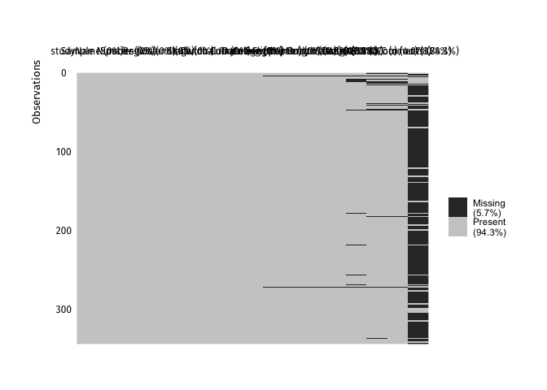
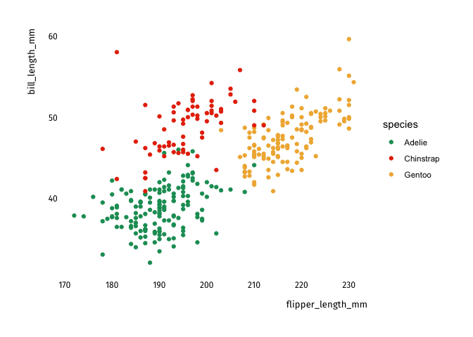
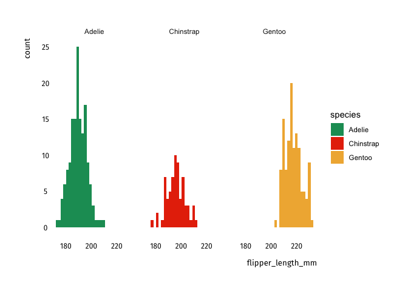
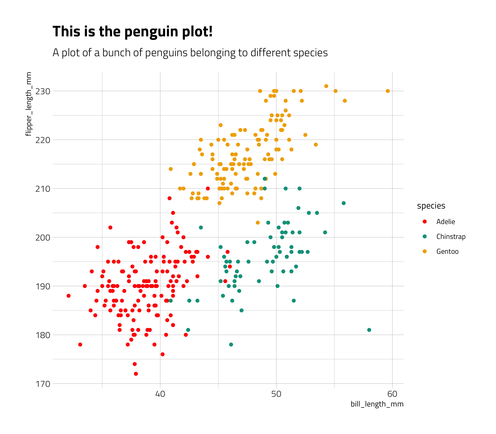

# Data importing and cleaning

Typically, you will receive a dataset that is most likely in an Excel
(`.xlsx` or `.xls`) or `.csv` (comma-separated values) format, which you
will have to load and clean before analyzing it. In this template we use
the `penguins` sample dataset available in the `palmerpenguins` package,
so we don’t actually read in any data. Just remember that you can easily
do that with the `read_csv` (for csv files), `read_excel`, or `read_dta`
(for Stata files) functions. If you want to learn more about reading in
data, a tutorial is available on our knowledge-sharing
[platform](https://kyso.io/dashboard?s=data&team=ideas42data).

First, we load all the packages we’ll need:

``` r
library(palmerpenguins)
library(visdat)
library(skimr)
library(tidyverse)
library(tools42)

# Using the penguins dataset
data(penguins)
```

A good way to start is by looking at what variables are available in our
dataset, as well as the number of observations. The `skim` function in
the `skimr` package is a quick and easy way to summarize this. Consider
it a beefed-up replacement of the Stata `summarize` command. You’ll see
you also get tiny histograms for your continuous data. Visualizing your
data is **critical** and you should always, always spend some time
plotting it. You won’t understand your data unless you plot it.

``` r
skim(penguins)
```

|                                                  |          |
|:-------------------------------------------------|:---------|
| Name                                             | penguins |
| Number of rows                                   | 344      |
| Number of columns                                | 8        |
| \_\_\_\_\_\_\_\_\_\_\_\_\_\_\_\_\_\_\_\_\_\_\_   |          |
| Column type frequency:                           |          |
| factor                                           | 3        |
| numeric                                          | 5        |
| \_\_\_\_\_\_\_\_\_\_\_\_\_\_\_\_\_\_\_\_\_\_\_\_ |          |
| Group variables                                  | None     |

Data summary

**Variable type: factor**

| skim\_variable | n\_missing | complete\_rate | ordered | n\_unique | top\_counts                 |
|:---------------|-----------:|---------------:|:--------|----------:|:----------------------------|
| species        |          0 |           1.00 | FALSE   |         3 | Ade: 152, Gen: 124, Chi: 68 |
| island         |          0 |           1.00 | FALSE   |         3 | Bis: 168, Dre: 124, Tor: 52 |
| sex            |         11 |           0.97 | FALSE   |         2 | mal: 168, fem: 165          |

**Variable type: numeric**

| skim\_variable      | n\_missing | complete\_rate |    mean |     sd |     p0 |     p25 |     p50 |    p75 |   p100 | hist  |
|:--------------------|-----------:|---------------:|--------:|-------:|-------:|--------:|--------:|-------:|-------:|:------|
| bill\_length\_mm    |          2 |           0.99 |   43.92 |   5.46 |   32.1 |   39.23 |   44.45 |   48.5 |   59.6 | ▃▇▇▆▁ |
| bill\_depth\_mm     |          2 |           0.99 |   17.15 |   1.97 |   13.1 |   15.60 |   17.30 |   18.7 |   21.5 | ▅▅▇▇▂ |
| flipper\_length\_mm |          2 |           0.99 |  200.92 |  14.06 |  172.0 |  190.00 |  197.00 |  213.0 |  231.0 | ▂▇▃▅▂ |
| body\_mass\_g       |          2 |           0.99 | 4201.75 | 801.95 | 2700.0 | 3550.00 | 4050.00 | 4750.0 | 6300.0 | ▃▇▆▃▂ |
| year                |          0 |           1.00 | 2008.03 |   0.82 | 2007.0 | 2007.00 | 2008.00 | 2009.0 | 2009.0 | ▇▁▇▁▇ |

Great. Looks like most of our data is complete and falls under the
expected ranges (that is, there are no crazy values for any of the
variables). Let’s get a sense of which variables are continuous and
which are categorical (character or factor).

We can do that with the `vis_dat` function, which plots every
observation and color-codes it by variable type. We could make it look
nicer by adding the i42 theme, since this is a `ggplot` object.

``` r
vis_dat(penguins_raw) 
```

<!-- -->

Isn’t this cool? There’s also a function to see the degree of
missingness for each of our variables. It’s called `vis_miss`:

``` r
vis_miss(penguins_raw) 
```

<!-- -->

# Exploratory Analysis

Ok, let’s look at the relationships between variables.

This is interesting. I wonder if there’s any differences by species!

``` r
penguins %>%
  viz_scatter(flipper_length_mm, bill_length_mm) +
  aes(color = species) +
  theme_42() +
  scale_color_manual(values = palette_42("i42_bright"))
```

<!-- -->

Now, a histogram of flipper length:

``` r
penguins %>%
  viz_hist(flipper_length_mm) +
  aes(fill = species) +
  facet_wrap(~species) +
  theme_42() +
  scale_fill_manual(values = palette_42("i42_bright"))
```

<!-- -->

# Let’s try a regression

``` r
penguins %>%
  ggplot(aes(color = species, x = bill_length_mm, y = flipper_length_mm)) +
  geom_point() +
  theme_42_bright() +
  scale_color_manual(values=palette_42("i42_bright")) +
  labs(title = "This is the penguin plot!",
       subtitle = "A plot of a bunch of penguins belonging to different species")
```

<!-- -->

``` r
model1 <- lm(flipper_length_mm ~ bill_length_mm + species, data = penguins)

summary(model1)
```

    ## 
    ## Call:
    ## lm(formula = flipper_length_mm ~ bill_length_mm + species, data = penguins)
    ## 
    ## Residuals:
    ##      Min       1Q   Median       3Q      Max 
    ## -24.7485  -3.4135  -0.0681   3.6607  15.9965 
    ## 
    ## Coefficients:
    ##                  Estimate Std. Error t value Pr(>|t|)    
    ## (Intercept)      147.9511     4.1738  35.447   <2e-16 ***
    ## bill_length_mm     1.0828     0.1069  10.129   <2e-16 ***
    ## speciesChinstrap  -5.0039     1.3698  -3.653    3e-04 ***
    ## speciesGentoo     17.7986     1.1698  15.216   <2e-16 ***
    ## ---
    ## Signif. codes:  0 '***' 0.001 '**' 0.01 '*' 0.05 '.' 0.1 ' ' 1
    ## 
    ## Residual standard error: 5.826 on 338 degrees of freedom
    ##   (2 observations deleted due to missingness)
    ## Multiple R-squared:  0.8299, Adjusted R-squared:  0.8284 
    ## F-statistic: 549.6 on 3 and 338 DF,  p-value: < 2.2e-16

And now, a regression table!

``` r
#library(modelsummary)
library(huxtable)
#options(huxtable.print = print_html)
#options('huxtable.knitr_output_format')
#options(huxtable.knitr_output_format = 'html')


huxreg(model1)
```

               ─────────────────────────────────────────────────
                                                           (1)  
                                       ─────────────────────────
                 (Intercept)                       147.951 ***  
                                                    (4.174)     
                 bill_length_mm                      1.083 ***  
                                                    (0.107)     
                 speciesChinstrap                   -5.004 ***  
                                                    (1.370)     
                 speciesGentoo                      17.799 ***  
                                                    (1.170)     
                                       ─────────────────────────
                 N                                 342          
                 R2                                  0.830      
                 logLik                          -1085.965      
                 AIC                              2181.930      
               ─────────────────────────────────────────────────
                 *** p < 0.001; ** p < 0.01; * p < 0.05.        

Column names: names, model1

Let’s look at a summary table.

``` r
library(gtsummary)

tbl_summary(select(penguins, species, bill_length_mm)) %>%
  as_kable(format = 'markdown')
```

| **Characteristic** | **N = 344**       |
|:-------------------|:------------------|
| species            |                   |
| Adelie             | 152 (44%)         |
| Chinstrap          | 68 (20%)          |
| Gentoo             | 124 (36%)         |
| bill\_length\_mm   | 44.5 (39.2, 48.5) |
| Unknown            | 2                 |

``` r
library(modelsummary)
modelsummary(model1, output = "markdown")
```

|                  |  Model 1  |
|:-----------------|:---------:|
| (Intercept)      |  147.951  |
|                  |  (4.174)  |
| bill\_length\_mm |   1.083   |
|                  |  (0.107)  |
| speciesChinstrap |  -5.004   |
|                  |  (1.370)  |
| speciesGentoo    |  17.799   |
|                  |  (1.170)  |
| Num.Obs.         |    342    |
| R2               |   0.830   |
| R2 Adj.          |   0.828   |
| AIC              |  2181.9   |
| BIC              |  2201.1   |
| Log.Lik.         | -1085.965 |
| F                |  549.569  |

``` r
datasummary_skim(penguins, format='markdown')
```

<table class="table" style="width: auto !important; margin-left: auto; margin-right: auto;">
<thead>
<tr>
<th style="text-align:left;">
</th>
<th style="text-align:right;">
Unique (\#)
</th>
<th style="text-align:right;">
Missing (%)
</th>
<th style="text-align:right;">
Mean
</th>
<th style="text-align:right;">
SD
</th>
<th style="text-align:right;">
Min
</th>
<th style="text-align:right;">
Median
</th>
<th style="text-align:right;">
Max
</th>
<th style="text-align:right;">
</th>
</tr>
</thead>
<tbody>
<tr>
<td style="text-align:left;">
bill\_length\_mm
</td>
<td style="text-align:right;">
165
</td>
<td style="text-align:right;">
1
</td>
<td style="text-align:right;">
43.9
</td>
<td style="text-align:right;">
5.5
</td>
<td style="text-align:right;">
32.1
</td>
<td style="text-align:right;">
44.5
</td>
<td style="text-align:right;">
59.6
</td>
<td style="text-align:right;">
<svg xmlns="http://www.w3.org/2000/svg" xmlns:xlink="http://www.w3.org/1999/xlink" width="48pt" height="12pt" viewBox="0 0 48 12" version="1.1">
<g id="surface1"><path style="fill-rule:nonzero;fill:rgb(0%,0%,0%);fill-opacity:1;stroke-width:0.375;stroke-linecap:round;stroke-linejoin:round;stroke:rgb(0%,0%,0%);stroke-opacity:1;stroke-miterlimit:10;" d="M 1.617188 11.664062 L 4.847656 11.664062 L 4.847656 10.859375 L 1.617188 10.859375 Z M 1.617188 11.664062 "></path><path style="fill-rule:nonzero;fill:rgb(0%,0%,0%);fill-opacity:1;stroke-width:0.375;stroke-linecap:round;stroke-linejoin:round;stroke:rgb(0%,0%,0%);stroke-opacity:1;stroke-miterlimit:10;" d="M 4.847656 11.664062 L 8.078125 11.664062 L 8.078125 7.242188 L 4.847656 7.242188 Z M 4.847656 11.664062 "></path><path style="fill-rule:nonzero;fill:rgb(0%,0%,0%);fill-opacity:1;stroke-width:0.375;stroke-linecap:round;stroke-linejoin:round;stroke:rgb(0%,0%,0%);stroke-opacity:1;stroke-miterlimit:10;" d="M 8.082031 11.664062 L 11.3125 11.664062 L 11.3125 4.425781 L 8.082031 4.425781 Z M 8.082031 11.664062 "></path><path style="fill-rule:nonzero;fill:rgb(0%,0%,0%);fill-opacity:1;stroke-width:0.375;stroke-linecap:round;stroke-linejoin:round;stroke:rgb(0%,0%,0%);stroke-opacity:1;stroke-miterlimit:10;" d="M 11.3125 11.664062 L 14.542969 11.664062 L 14.542969 4.023438 L 11.3125 4.023438 Z M 11.3125 11.664062 "></path><path style="fill-rule:nonzero;fill:rgb(0%,0%,0%);fill-opacity:1;stroke-width:0.375;stroke-linecap:round;stroke-linejoin:round;stroke:rgb(0%,0%,0%);stroke-opacity:1;stroke-miterlimit:10;" d="M 14.546875 11.664062 L 17.777344 11.664062 L 17.777344 3.824219 L 14.546875 3.824219 Z M 14.546875 11.664062 "></path><path style="fill-rule:nonzero;fill:rgb(0%,0%,0%);fill-opacity:1;stroke-width:0.375;stroke-linecap:round;stroke-linejoin:round;stroke:rgb(0%,0%,0%);stroke-opacity:1;stroke-miterlimit:10;" d="M 17.777344 11.664062 L 21.007812 11.664062 L 21.007812 5.832031 L 17.777344 5.832031 Z M 17.777344 11.664062 "></path><path style="fill-rule:nonzero;fill:rgb(0%,0%,0%);fill-opacity:1;stroke-width:0.375;stroke-linecap:round;stroke-linejoin:round;stroke:rgb(0%,0%,0%);stroke-opacity:1;stroke-miterlimit:10;" d="M 21.011719 11.664062 L 24.242188 11.664062 L 24.242188 4.023438 L 21.011719 4.023438 Z M 21.011719 11.664062 "></path><path style="fill-rule:nonzero;fill:rgb(0%,0%,0%);fill-opacity:1;stroke-width:0.375;stroke-linecap:round;stroke-linejoin:round;stroke:rgb(0%,0%,0%);stroke-opacity:1;stroke-miterlimit:10;" d="M 24.242188 11.664062 L 27.472656 11.664062 L 27.472656 3.21875 L 24.242188 3.21875 Z M 24.242188 11.664062 "></path><path style="fill-rule:nonzero;fill:rgb(0%,0%,0%);fill-opacity:1;stroke-width:0.375;stroke-linecap:round;stroke-linejoin:round;stroke:rgb(0%,0%,0%);stroke-opacity:1;stroke-miterlimit:10;" d="M 27.476562 11.664062 L 30.707031 11.664062 L 30.707031 3.21875 L 27.476562 3.21875 Z M 27.476562 11.664062 "></path><path style="fill-rule:nonzero;fill:rgb(0%,0%,0%);fill-opacity:1;stroke-width:0.375;stroke-linecap:round;stroke-linejoin:round;stroke:rgb(0%,0%,0%);stroke-opacity:1;stroke-miterlimit:10;" d="M 30.707031 11.664062 L 33.9375 11.664062 L 33.9375 4.226562 L 30.707031 4.226562 Z M 30.707031 11.664062 "></path><path style="fill-rule:nonzero;fill:rgb(0%,0%,0%);fill-opacity:1;stroke-width:0.375;stroke-linecap:round;stroke-linejoin:round;stroke:rgb(0%,0%,0%);stroke-opacity:1;stroke-miterlimit:10;" d="M 33.9375 11.664062 L 37.167969 11.664062 L 37.167969 10.054688 L 33.9375 10.054688 Z M 33.9375 11.664062 "></path><path style="fill-rule:nonzero;fill:rgb(0%,0%,0%);fill-opacity:1;stroke-width:0.375;stroke-linecap:round;stroke-linejoin:round;stroke:rgb(0%,0%,0%);stroke-opacity:1;stroke-miterlimit:10;" d="M 37.171875 11.664062 L 40.402344 11.664062 L 40.402344 10.660156 L 37.171875 10.660156 Z M 37.171875 11.664062 "></path><path style="fill-rule:nonzero;fill:rgb(0%,0%,0%);fill-opacity:1;stroke-width:0.375;stroke-linecap:round;stroke-linejoin:round;stroke:rgb(0%,0%,0%);stroke-opacity:1;stroke-miterlimit:10;" d="M 40.402344 11.664062 L 43.632812 11.664062 L 43.632812 11.464844 L 40.402344 11.464844 Z M 40.402344 11.664062 "></path><path style="fill-rule:nonzero;fill:rgb(0%,0%,0%);fill-opacity:1;stroke-width:0.375;stroke-linecap:round;stroke-linejoin:round;stroke:rgb(0%,0%,0%);stroke-opacity:1;stroke-miterlimit:10;" d="M 43.636719 11.664062 L 46.867188 11.664062 L 46.867188 11.464844 L 43.636719 11.464844 Z M 43.636719 11.664062 "></path></g>
</svg>
</td>
</tr>
<tr>
<td style="text-align:left;">
bill\_depth\_mm
</td>
<td style="text-align:right;">
81
</td>
<td style="text-align:right;">
1
</td>
<td style="text-align:right;">
17.2
</td>
<td style="text-align:right;">
2.0
</td>
<td style="text-align:right;">
13.1
</td>
<td style="text-align:right;">
17.3
</td>
<td style="text-align:right;">
21.5
</td>
<td style="text-align:right;">
<svg xmlns="http://www.w3.org/2000/svg" xmlns:xlink="http://www.w3.org/1999/xlink" width="48pt" height="12pt" viewBox="0 0 48 12" version="1.1">
<g id="surface6"><path style="fill-rule:nonzero;fill:rgb(0%,0%,0%);fill-opacity:1;stroke-width:0.375;stroke-linecap:round;stroke-linejoin:round;stroke:rgb(0%,0%,0%);stroke-opacity:1;stroke-miterlimit:10;" d="M 1.25 11.664062 L 6.539062 11.664062 L 6.539062 9.039062 L 1.25 9.039062 Z M 1.25 11.664062 "></path><path style="fill-rule:nonzero;fill:rgb(0%,0%,0%);fill-opacity:1;stroke-width:0.375;stroke-linecap:round;stroke-linejoin:round;stroke:rgb(0%,0%,0%);stroke-opacity:1;stroke-miterlimit:10;" d="M 6.539062 11.664062 L 11.828125 11.664062 L 11.828125 6.300781 L 6.539062 6.300781 Z M 6.539062 11.664062 "></path><path style="fill-rule:nonzero;fill:rgb(0%,0%,0%);fill-opacity:1;stroke-width:0.375;stroke-linecap:round;stroke-linejoin:round;stroke:rgb(0%,0%,0%);stroke-opacity:1;stroke-miterlimit:10;" d="M 11.832031 11.664062 L 17.121094 11.664062 L 17.121094 7.441406 L 11.832031 7.441406 Z M 11.832031 11.664062 "></path><path style="fill-rule:nonzero;fill:rgb(0%,0%,0%);fill-opacity:1;stroke-width:0.375;stroke-linecap:round;stroke-linejoin:round;stroke:rgb(0%,0%,0%);stroke-opacity:1;stroke-miterlimit:10;" d="M 17.121094 11.664062 L 22.410156 11.664062 L 22.410156 6.527344 L 17.121094 6.527344 Z M 17.121094 11.664062 "></path><path style="fill-rule:nonzero;fill:rgb(0%,0%,0%);fill-opacity:1;stroke-width:0.375;stroke-linecap:round;stroke-linejoin:round;stroke:rgb(0%,0%,0%);stroke-opacity:1;stroke-miterlimit:10;" d="M 22.414062 11.664062 L 27.703125 11.664062 L 27.703125 4.816406 L 22.414062 4.816406 Z M 22.414062 11.664062 "></path><path style="fill-rule:nonzero;fill:rgb(0%,0%,0%);fill-opacity:1;stroke-width:0.375;stroke-linecap:round;stroke-linejoin:round;stroke:rgb(0%,0%,0%);stroke-opacity:1;stroke-miterlimit:10;" d="M 27.703125 11.664062 L 32.992188 11.664062 L 32.992188 3.21875 L 27.703125 3.21875 Z M 27.703125 11.664062 "></path><path style="fill-rule:nonzero;fill:rgb(0%,0%,0%);fill-opacity:1;stroke-width:0.375;stroke-linecap:round;stroke-linejoin:round;stroke:rgb(0%,0%,0%);stroke-opacity:1;stroke-miterlimit:10;" d="M 32.996094 11.664062 L 38.285156 11.664062 L 38.285156 7.214844 L 32.996094 7.214844 Z M 32.996094 11.664062 "></path><path style="fill-rule:nonzero;fill:rgb(0%,0%,0%);fill-opacity:1;stroke-width:0.375;stroke-linecap:round;stroke-linejoin:round;stroke:rgb(0%,0%,0%);stroke-opacity:1;stroke-miterlimit:10;" d="M 38.285156 11.664062 L 43.574219 11.664062 L 43.574219 10.410156 L 38.285156 10.410156 Z M 38.285156 11.664062 "></path><path style="fill-rule:nonzero;fill:rgb(0%,0%,0%);fill-opacity:1;stroke-width:0.375;stroke-linecap:round;stroke-linejoin:round;stroke:rgb(0%,0%,0%);stroke-opacity:1;stroke-miterlimit:10;" d="M 43.578125 11.664062 L 48.867188 11.664062 L 48.867188 10.980469 L 43.578125 10.980469 Z M 43.578125 11.664062 "></path></g>
</svg>
</td>
</tr>
<tr>
<td style="text-align:left;">
flipper\_length\_mm
</td>
<td style="text-align:right;">
56
</td>
<td style="text-align:right;">
1
</td>
<td style="text-align:right;">
200.9
</td>
<td style="text-align:right;">
14.1
</td>
<td style="text-align:right;">
172
</td>
<td style="text-align:right;">
197.0
</td>
<td style="text-align:right;">
231
</td>
<td style="text-align:right;">
<svg xmlns="http://www.w3.org/2000/svg" xmlns:xlink="http://www.w3.org/1999/xlink" width="48pt" height="12pt" viewBox="0 0 48 12" version="1.1">
<g id="surface11"><path style="fill-rule:nonzero;fill:rgb(0%,0%,0%);fill-opacity:1;stroke-width:0.375;stroke-linecap:round;stroke-linejoin:round;stroke:rgb(0%,0%,0%);stroke-opacity:1;stroke-miterlimit:10;" d="M 0.269531 11.664062 L 4.035156 11.664062 L 4.035156 11.371094 L 0.269531 11.371094 Z M 0.269531 11.664062 "></path><path style="fill-rule:nonzero;fill:rgb(0%,0%,0%);fill-opacity:1;stroke-width:0.375;stroke-linecap:round;stroke-linejoin:round;stroke:rgb(0%,0%,0%);stroke-opacity:1;stroke-miterlimit:10;" d="M 4.039062 11.664062 L 7.804688 11.664062 L 7.804688 10.0625 L 4.039062 10.0625 Z M 4.039062 11.664062 "></path><path style="fill-rule:nonzero;fill:rgb(0%,0%,0%);fill-opacity:1;stroke-width:0.375;stroke-linecap:round;stroke-linejoin:round;stroke:rgb(0%,0%,0%);stroke-opacity:1;stroke-miterlimit:10;" d="M 7.804688 11.664062 L 11.570312 11.664062 L 11.570312 7.585938 L 7.804688 7.585938 Z M 7.804688 11.664062 "></path><path style="fill-rule:nonzero;fill:rgb(0%,0%,0%);fill-opacity:1;stroke-width:0.375;stroke-linecap:round;stroke-linejoin:round;stroke:rgb(0%,0%,0%);stroke-opacity:1;stroke-miterlimit:10;" d="M 11.570312 11.664062 L 15.335938 11.664062 L 15.335938 3.21875 L 11.570312 3.21875 Z M 11.570312 11.664062 "></path><path style="fill-rule:nonzero;fill:rgb(0%,0%,0%);fill-opacity:1;stroke-width:0.375;stroke-linecap:round;stroke-linejoin:round;stroke:rgb(0%,0%,0%);stroke-opacity:1;stroke-miterlimit:10;" d="M 15.335938 11.664062 L 19.101562 11.664062 L 19.101562 3.363281 L 15.335938 3.363281 Z M 15.335938 11.664062 "></path><path style="fill-rule:nonzero;fill:rgb(0%,0%,0%);fill-opacity:1;stroke-width:0.375;stroke-linecap:round;stroke-linejoin:round;stroke:rgb(0%,0%,0%);stroke-opacity:1;stroke-miterlimit:10;" d="M 19.105469 11.664062 L 22.871094 11.664062 L 22.871094 6.132812 L 19.105469 6.132812 Z M 19.105469 11.664062 "></path><path style="fill-rule:nonzero;fill:rgb(0%,0%,0%);fill-opacity:1;stroke-width:0.375;stroke-linecap:round;stroke-linejoin:round;stroke:rgb(0%,0%,0%);stroke-opacity:1;stroke-miterlimit:10;" d="M 22.871094 11.664062 L 26.636719 11.664062 L 26.636719 9.042969 L 22.871094 9.042969 Z M 22.871094 11.664062 "></path><path style="fill-rule:nonzero;fill:rgb(0%,0%,0%);fill-opacity:1;stroke-width:0.375;stroke-linecap:round;stroke-linejoin:round;stroke:rgb(0%,0%,0%);stroke-opacity:1;stroke-miterlimit:10;" d="M 26.636719 11.664062 L 30.402344 11.664062 L 30.402344 7.296875 L 26.636719 7.296875 Z M 26.636719 11.664062 "></path><path style="fill-rule:nonzero;fill:rgb(0%,0%,0%);fill-opacity:1;stroke-width:0.375;stroke-linecap:round;stroke-linejoin:round;stroke:rgb(0%,0%,0%);stroke-opacity:1;stroke-miterlimit:10;" d="M 30.402344 11.664062 L 34.167969 11.664062 L 34.167969 6.859375 L 30.402344 6.859375 Z M 30.402344 11.664062 "></path><path style="fill-rule:nonzero;fill:rgb(0%,0%,0%);fill-opacity:1;stroke-width:0.375;stroke-linecap:round;stroke-linejoin:round;stroke:rgb(0%,0%,0%);stroke-opacity:1;stroke-miterlimit:10;" d="M 34.167969 11.664062 L 37.933594 11.664062 L 37.933594 7.003906 L 34.167969 7.003906 Z M 34.167969 11.664062 "></path><path style="fill-rule:nonzero;fill:rgb(0%,0%,0%);fill-opacity:1;stroke-width:0.375;stroke-linecap:round;stroke-linejoin:round;stroke:rgb(0%,0%,0%);stroke-opacity:1;stroke-miterlimit:10;" d="M 37.9375 11.664062 L 41.703125 11.664062 L 41.703125 8.753906 L 37.9375 8.753906 Z M 37.9375 11.664062 "></path><path style="fill-rule:nonzero;fill:rgb(0%,0%,0%);fill-opacity:1;stroke-width:0.375;stroke-linecap:round;stroke-linejoin:round;stroke:rgb(0%,0%,0%);stroke-opacity:1;stroke-miterlimit:10;" d="M 41.703125 11.664062 L 45.46875 11.664062 L 45.46875 9.625 L 41.703125 9.625 Z M 41.703125 11.664062 "></path><path style="fill-rule:nonzero;fill:rgb(0%,0%,0%);fill-opacity:1;stroke-width:0.375;stroke-linecap:round;stroke-linejoin:round;stroke:rgb(0%,0%,0%);stroke-opacity:1;stroke-miterlimit:10;" d="M 45.46875 11.664062 L 49.234375 11.664062 L 49.234375 11.519531 L 45.46875 11.519531 Z M 45.46875 11.664062 "></path></g>
</svg>
</td>
</tr>
<tr>
<td style="text-align:left;">
body\_mass\_g
</td>
<td style="text-align:right;">
95
</td>
<td style="text-align:right;">
1
</td>
<td style="text-align:right;">
4201.8
</td>
<td style="text-align:right;">
802.0
</td>
<td style="text-align:right;">
2700
</td>
<td style="text-align:right;">
4050.0
</td>
<td style="text-align:right;">
6300
</td>
<td style="text-align:right;">
<svg xmlns="http://www.w3.org/2000/svg" xmlns:xlink="http://www.w3.org/1999/xlink" width="48pt" height="12pt" viewBox="0 0 48 12" version="1.1">
<g id="surface16"><path style="fill-rule:nonzero;fill:rgb(0%,0%,0%);fill-opacity:1;stroke-width:0.375;stroke-linecap:round;stroke-linejoin:round;stroke:rgb(0%,0%,0%);stroke-opacity:1;stroke-miterlimit:10;" d="M -0.691406 11.664062 L 5.480469 11.664062 L 5.480469 10.65625 L -0.691406 10.65625 Z M -0.691406 11.664062 "></path><path style="fill-rule:nonzero;fill:rgb(0%,0%,0%);fill-opacity:1;stroke-width:0.375;stroke-linecap:round;stroke-linejoin:round;stroke:rgb(0%,0%,0%);stroke-opacity:1;stroke-miterlimit:10;" d="M 5.480469 11.664062 L 11.652344 11.664062 L 11.652344 5.515625 L 5.480469 5.515625 Z M 5.480469 11.664062 "></path><path style="fill-rule:nonzero;fill:rgb(0%,0%,0%);fill-opacity:1;stroke-width:0.375;stroke-linecap:round;stroke-linejoin:round;stroke:rgb(0%,0%,0%);stroke-opacity:1;stroke-miterlimit:10;" d="M 11.65625 11.664062 L 17.828125 11.664062 L 17.828125 3.21875 L 11.65625 3.21875 Z M 11.65625 11.664062 "></path><path style="fill-rule:nonzero;fill:rgb(0%,0%,0%);fill-opacity:1;stroke-width:0.375;stroke-linecap:round;stroke-linejoin:round;stroke:rgb(0%,0%,0%);stroke-opacity:1;stroke-miterlimit:10;" d="M 17.828125 11.664062 L 24 11.664062 L 24 6.433594 L 17.828125 6.433594 Z M 17.828125 11.664062 "></path><path style="fill-rule:nonzero;fill:rgb(0%,0%,0%);fill-opacity:1;stroke-width:0.375;stroke-linecap:round;stroke-linejoin:round;stroke:rgb(0%,0%,0%);stroke-opacity:1;stroke-miterlimit:10;" d="M 24 11.664062 L 30.171875 11.664062 L 30.171875 6.707031 L 24 6.707031 Z M 24 11.664062 "></path><path style="fill-rule:nonzero;fill:rgb(0%,0%,0%);fill-opacity:1;stroke-width:0.375;stroke-linecap:round;stroke-linejoin:round;stroke:rgb(0%,0%,0%);stroke-opacity:1;stroke-miterlimit:10;" d="M 30.171875 11.664062 L 36.34375 11.664062 L 36.34375 8.636719 L 30.171875 8.636719 Z M 30.171875 11.664062 "></path><path style="fill-rule:nonzero;fill:rgb(0%,0%,0%);fill-opacity:1;stroke-width:0.375;stroke-linecap:round;stroke-linejoin:round;stroke:rgb(0%,0%,0%);stroke-opacity:1;stroke-miterlimit:10;" d="M 36.34375 11.664062 L 42.515625 11.664062 L 42.515625 9.277344 L 36.34375 9.277344 Z M 36.34375 11.664062 "></path><path style="fill-rule:nonzero;fill:rgb(0%,0%,0%);fill-opacity:1;stroke-width:0.375;stroke-linecap:round;stroke-linejoin:round;stroke:rgb(0%,0%,0%);stroke-opacity:1;stroke-miterlimit:10;" d="M 42.519531 11.664062 L 48.691406 11.664062 L 48.691406 11.480469 L 42.519531 11.480469 Z M 42.519531 11.664062 "></path></g>
</svg>
</td>
</tr>
<tr>
<td style="text-align:left;">
year
</td>
<td style="text-align:right;">
3
</td>
<td style="text-align:right;">
0
</td>
<td style="text-align:right;">
2008.0
</td>
<td style="text-align:right;">
0.8
</td>
<td style="text-align:right;">
2007
</td>
<td style="text-align:right;">
2008.0
</td>
<td style="text-align:right;">
2009
</td>
<td style="text-align:right;">
<svg xmlns="http://www.w3.org/2000/svg" xmlns:xlink="http://www.w3.org/1999/xlink" width="48pt" height="12pt" viewBox="0 0 48 12" version="1.1">
<g id="surface21"><path style="fill-rule:nonzero;fill:rgb(0%,0%,0%);fill-opacity:1;stroke-width:0.375;stroke-linecap:round;stroke-linejoin:round;stroke:rgb(0%,0%,0%);stroke-opacity:1;stroke-miterlimit:10;" d="M 1.777344 11.664062 L 6.222656 11.664062 L 6.222656 3.921875 L 1.777344 3.921875 Z M 1.777344 11.664062 "></path><path style="fill:none;stroke-width:0.375;stroke-linecap:round;stroke-linejoin:round;stroke:rgb(0%,0%,0%);stroke-opacity:1;stroke-miterlimit:10;" d="M 6.222656 11.664062 L 10.667969 11.664062 Z M 6.222656 11.664062 "></path><path style="fill:none;stroke-width:0.375;stroke-linecap:round;stroke-linejoin:round;stroke:rgb(0%,0%,0%);stroke-opacity:1;stroke-miterlimit:10;" d="M 10.667969 11.664062 L 15.113281 11.664062 Z M 10.667969 11.664062 "></path><path style="fill:none;stroke-width:0.375;stroke-linecap:round;stroke-linejoin:round;stroke:rgb(0%,0%,0%);stroke-opacity:1;stroke-miterlimit:10;" d="M 15.109375 11.664062 L 19.554688 11.664062 Z M 15.109375 11.664062 "></path><path style="fill-rule:nonzero;fill:rgb(0%,0%,0%);fill-opacity:1;stroke-width:0.375;stroke-linecap:round;stroke-linejoin:round;stroke:rgb(0%,0%,0%);stroke-opacity:1;stroke-miterlimit:10;" d="M 19.554688 11.664062 L 24 11.664062 L 24 3.640625 L 19.554688 3.640625 Z M 19.554688 11.664062 "></path><path style="fill:none;stroke-width:0.375;stroke-linecap:round;stroke-linejoin:round;stroke:rgb(0%,0%,0%);stroke-opacity:1;stroke-miterlimit:10;" d="M 24 11.664062 L 28.445312 11.664062 Z M 24 11.664062 "></path><path style="fill:none;stroke-width:0.375;stroke-linecap:round;stroke-linejoin:round;stroke:rgb(0%,0%,0%);stroke-opacity:1;stroke-miterlimit:10;" d="M 28.445312 11.664062 L 32.890625 11.664062 Z M 28.445312 11.664062 "></path><path style="fill:none;stroke-width:0.375;stroke-linecap:round;stroke-linejoin:round;stroke:rgb(0%,0%,0%);stroke-opacity:1;stroke-miterlimit:10;" d="M 32.890625 11.664062 L 37.335938 11.664062 Z M 32.890625 11.664062 "></path><path style="fill:none;stroke-width:0.375;stroke-linecap:round;stroke-linejoin:round;stroke:rgb(0%,0%,0%);stroke-opacity:1;stroke-miterlimit:10;" d="M 37.332031 11.664062 L 41.777344 11.664062 Z M 37.332031 11.664062 "></path><path style="fill-rule:nonzero;fill:rgb(0%,0%,0%);fill-opacity:1;stroke-width:0.375;stroke-linecap:round;stroke-linejoin:round;stroke:rgb(0%,0%,0%);stroke-opacity:1;stroke-miterlimit:10;" d="M 41.777344 11.664062 L 46.222656 11.664062 L 46.222656 3.21875 L 41.777344 3.21875 Z M 41.777344 11.664062 "></path></g>
</svg>
</td>
</tr>
</tbody>
</table>
