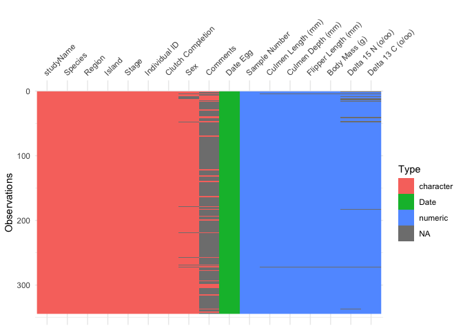
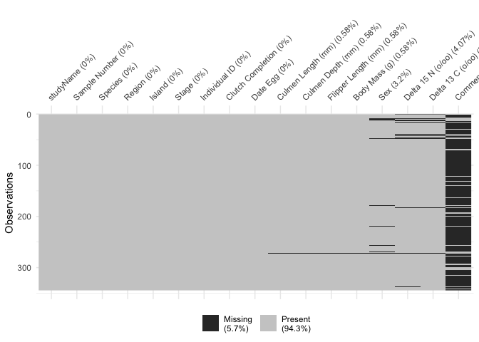
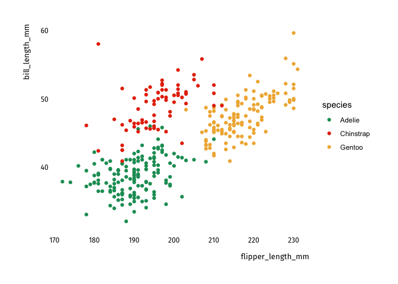
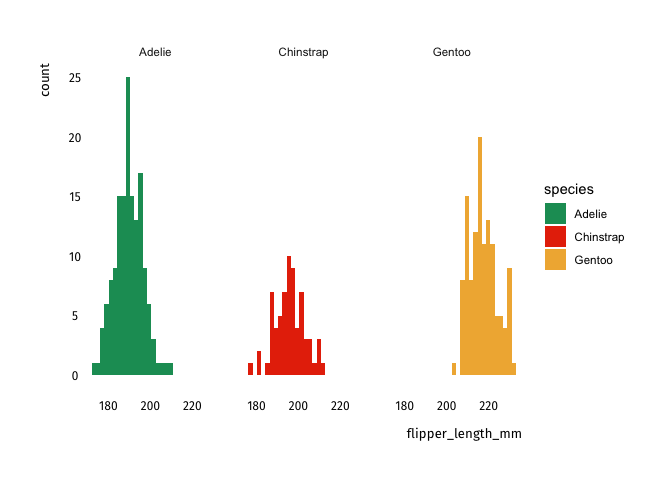
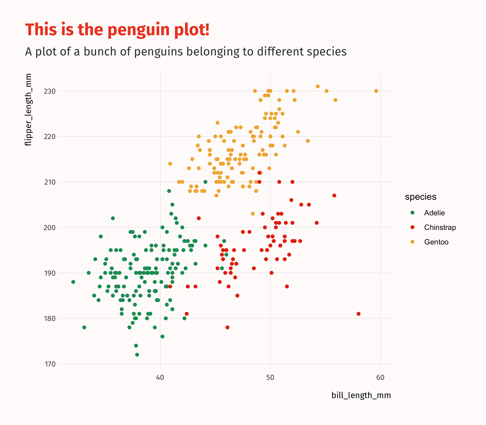

Data importing and cleaning
===========================

Typically, you will receive a dataset that is most likely in an Excel
(`.xlsx` or `.xls`) or `.csv` (comma-separated values) format, which you
will have to load and clean before analyzing it. In this template we use
the `penguins` sample dataset available in the `palmerpenguins` package,
so we don't actually read in any data. Just remember that you can easily
do that with the `read_csv` (for csv files), `read_excel`, or `read_dta`
(for Stata files) functions. If you want to learn more about reading in
data, a tutorial is available on our knowledge-sharing
[platform](https://kyso.io/dashboard?s=data&team=ideas42data).

First, we load all the packages we'll need:

``` {.r}
library(palmerpenguins)
library(visdat)
library(skimr)
library(tidyverse)
library(tools42)

# Using the penguins dataset
data(penguins)
```

A good way to start is by looking at what variables are available in our
dataset, as well as the number of observations. The `skim` function in
the `skimr` package is a quick and easy way to summarize this. Consider
it a beefed-up replacement of the Stata `summarize` command. You'll see
you also get tiny histograms for your continuous data. Visualizing your
data is **critical** and you should always, always spend some time
plotting it. You won't understand your data unless you plot it.

``` {.r}
skim(penguins)
```

  -------------------------------------------------- ----------
  Name                                               penguins
  Number of rows                                     344
  Number of columns                                  8
  \_\_\_\_\_\_\_\_\_\_\_\_\_\_\_\_\_\_\_\_\_\_\_     
  Column type frequency:                             
  factor                                             3
  numeric                                            5
  \_\_\_\_\_\_\_\_\_\_\_\_\_\_\_\_\_\_\_\_\_\_\_\_   
  Group variables                                    None
  -------------------------------------------------- ----------

  : Data summary

**Variable type: factor**

  skim_variable     n_missing   complete_rate ordered     n_unique top_counts
  --------------- ----------- --------------- --------- ---------- -----------------------------
  species                   0            1.00 FALSE              3 Ade: 152, Gen: 124, Chi: 68
  island                    0            1.00 FALSE              3 Bis: 168, Dre: 124, Tor: 52
  sex                      11            0.97 FALSE              2 mal: 168, fem: 165

**Variable type: numeric**

  skim_variable         n_missing   complete_rate      mean       sd       p0       p25       p50      p75     p100 hist
  ------------------- ----------- --------------- --------- -------- -------- --------- --------- -------- -------- -------
  bill_length_mm                2            0.99     43.92     5.46     32.1     39.23     44.45     48.5     59.6 ▃▇▇▆▁
  bill_depth_mm                 2            0.99     17.15     1.97     13.1     15.60     17.30     18.7     21.5 ▅▅▇▇▂
  flipper_length_mm             2            0.99    200.92    14.06    172.0    190.00    197.00    213.0    231.0 ▂▇▃▅▂
  body_mass_g                   2            0.99   4201.75   801.95   2700.0   3550.00   4050.00   4750.0   6300.0 ▃▇▆▃▂
  year                          0            1.00   2008.03     0.82   2007.0   2007.00   2008.00   2009.0   2009.0 ▇▁▇▁▇

Great. Looks like most of our data is complete and falls under the
expected ranges (that is, there are no crazy values for any of the
variables). Let's get a sense of which variables are continuous and
which are categorical (character or factor).

We can do that with the `vis_dat` function, which plots every
observation and color-codes it by variable type. We could make it look
nicer by adding the i42 theme, since this is a `ggplot` object.

``` {.r}
vis_dat(penguins_raw) 
```



Isn't this cool? There's also a function to see the degree of
missingness for each of our variables. It's called `vis_miss`:

``` {.r}
vis_miss(penguins_raw) 
```



Exploratory Analysis
====================

Ok, let's look at the relationships between variables.

This is interesting. I wonder if there's any differences by species!

``` {.r}
penguins %>%
  viz_scatter(flipper_length_mm, bill_length_mm) +
  aes(color = species) +
  theme_42() +
  scale_color_manual(values = palette_42("i42_bright"))
```



Now, a histogram of flipper length:

``` {.r}
penguins %>%
  viz_hist(flipper_length_mm) +
  aes(fill = species) +
  facet_wrap(~species) +
  theme_42() +
  scale_fill_manual(values = palette_42("i42_bright"))
```



Let's try a regression
======================

``` {.r}
penguins %>%
  ggplot(aes(color = species, x = bill_length_mm, y = flipper_length_mm)) +
  geom_point() +
  theme_42_bright() +
  scale_color_manual(values=palette_42("i42_bright")) +
  labs(title = "This is the penguin plot!",
       subtitle = "A plot of a bunch of penguins belonging to different species")
```



``` {.r}
model1 <- lm(flipper_length_mm ~ bill_length_mm + species, data = penguins)

summary(model1)
```

    ## 
    ## Call:
    ## lm(formula = flipper_length_mm ~ bill_length_mm + species, data = penguins)
    ## 
    ## Residuals:
    ##      Min       1Q   Median       3Q      Max 
    ## -24.7485  -3.4135  -0.0681   3.6607  15.9965 
    ## 
    ## Coefficients:
    ##                  Estimate Std. Error t value Pr(>|t|)    
    ## (Intercept)      147.9511     4.1738  35.447   <2e-16 ***
    ## bill_length_mm     1.0828     0.1069  10.129   <2e-16 ***
    ## speciesChinstrap  -5.0039     1.3698  -3.653    3e-04 ***
    ## speciesGentoo     17.7986     1.1698  15.216   <2e-16 ***
    ## ---
    ## Signif. codes:  0 '***' 0.001 '**' 0.01 '*' 0.05 '.' 0.1 ' ' 1
    ## 
    ## Residual standard error: 5.826 on 338 degrees of freedom
    ##   (2 observations deleted due to missingness)
    ## Multiple R-squared:  0.8299, Adjusted R-squared:  0.8284 
    ## F-statistic: 549.6 on 3 and 338 DF,  p-value: < 2.2e-16

And now, a regression table!

``` {.r}
library(huxtable)


huxreg(model1) 
```

               ─────────────────────────────────────────────────
                                                           (1)  
                                       ─────────────────────────
                 (Intercept)                       147.951 ***  
                                                    (4.174)     
                 bill_length_mm                      1.083 ***  
                                                    (0.107)     
                 speciesChinstrap                   -5.004 ***  
                                                    (1.370)     
                 speciesGentoo                      17.799 ***  
                                                    (1.170)     
                                       ─────────────────────────
                 N                                 342          
                 R2                                  0.830      
                 logLik                          -1085.965      
                 AIC                              2181.930      
               ─────────────────────────────────────────────────
                 *** p < 0.001; ** p < 0.01; * p < 0.05.        

Column names: names, model1
