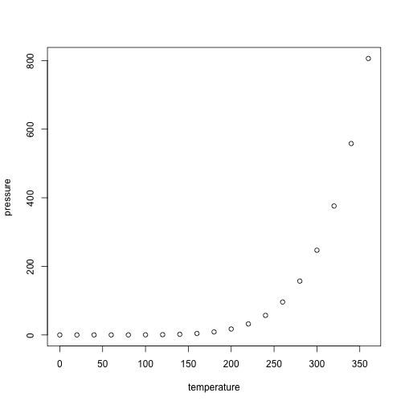

## R Markdown

This is an R Markdown document. Markdown is a simple formatting syntax for authoring HTML, PDF, and MS Word documents. For more details on using R Markdown see <http://rmarkdown.rstudio.com>.

When you click the **Knit** button a document will be generated that includes both content as well as the output of any embedded R code chunks within the document. You can embed an R code chunk like this:


```r
summary(cars)
```

```
##      speed           dist       
##  Min.   : 4.0   Min.   :  2.00  
##  1st Qu.:12.0   1st Qu.: 26.00  
##  Median :15.0   Median : 36.00  
##  Mean   :15.4   Mean   : 42.98  
##  3rd Qu.:19.0   3rd Qu.: 56.00  
##  Max.   :25.0   Max.   :120.00
```


## Including Plots

You can also embed plots, for example:


```r
plot(pressure)
```



Note that the `echo = FALSE` parameter was added to the code chunk to prevent printing of the R code that generated the plot.

## Now, let's try using other libraries


```r
library(skimr)
library(palmerpenguins)

skim(penguins)
```


Table: Data summary

|                         |         |
|:------------------------|:--------|
|Name                     |penguins |
|Number of rows           |344      |
|Number of columns        |8        |
|_______________________  |         |
|Column type frequency:   |         |
|factor                   |3        |
|numeric                  |5        |
|________________________ |         |
|Group variables          |None     |


**Variable type: factor**

|skim_variable | n_missing| complete_rate|ordered | n_unique|top_counts                  |
|:-------------|---------:|-------------:|:-------|--------:|:---------------------------|
|species       |         0|          1.00|FALSE   |        3|Ade: 152, Gen: 124, Chi: 68 |
|island        |         0|          1.00|FALSE   |        3|Bis: 168, Dre: 124, Tor: 52 |
|sex           |        11|          0.97|FALSE   |        2|mal: 168, fem: 165          |


**Variable type: numeric**

|skim_variable     | n_missing| complete_rate|    mean|     sd|     p0|     p25|     p50|    p75|   p100|hist  |
|:-----------------|---------:|-------------:|-------:|------:|------:|-------:|-------:|------:|------:|:-----|
|bill_length_mm    |         2|          0.99|   43.92|   5.46|   32.1|   39.23|   44.45|   48.5|   59.6|▃▇▇▆▁ |
|bill_depth_mm     |         2|          0.99|   17.15|   1.97|   13.1|   15.60|   17.30|   18.7|   21.5|▅▅▇▇▂ |
|flipper_length_mm |         2|          0.99|  200.92|  14.06|  172.0|  190.00|  197.00|  213.0|  231.0|▂▇▃▅▂ |
|body_mass_g       |         2|          0.99| 4201.75| 801.95| 2700.0| 3550.00| 4050.00| 4750.0| 6300.0|▃▇▆▃▂ |
|year              |         0|          1.00| 2008.03|   0.82| 2007.0| 2007.00| 2008.00| 2009.0| 2009.0|▇▁▇▁▇ |


Now, a plot.


```r
penguins %>%
  ggplot(aes(color = species, x = bill_length_mm, y = flipper_length_mm)) +
  geom_point() +
  theme_minimal()
```

```
## Warning: Removed 2 rows containing missing values (geom_point).
```


